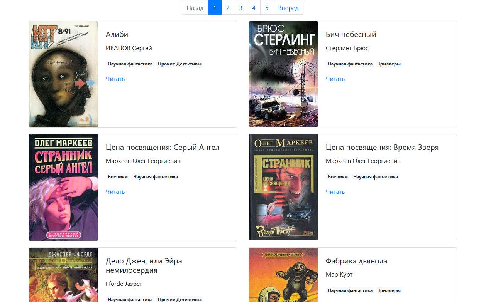

# Online library

The project was created for parse books from [tululu.org](http://tululu.org) and create own online/offline library.


[Russian doc](https://github.com/FaHoLo/Library_parse/blob/master/READMEru.md)

### Website example:



[Website in work](https://faholo.github.io/Library_parse/) 

### Installation

1. Python3 should already be installed.

2. It is recommended to use [virtualenv/venv](https://docs.python.org/3/library/venv.html) to isolate the project.

3. Use `pip` (or `pip3`, there is a conflict with Python2) to install the dependencies:
```
pip install -r requirements.txt
```

4. Run the file `parse_tululu_category.py` with or without arguments (more details [below](https://github.com/FaHoLo/Library_parse#arguments)).

#### If you want to read books offline

5. Run the file `render_website.py`.

6. Open file `index1.html` in your browser.

7. Choose book and click `Читать` to open book text.

#### If you want to develop your own website

5. Run the file `render_website.py` with argument `--run_debug`, script will render pages and host website locally on your PC with [livereload](https://github.com/lepture/python-livereload).

6. Open `http://127.0.0.1:5501/pages/index1.html` in your browser.

7. Change `template.html` as you want, livereload will re-render pages automatically. The result of changes will be displayed in browser.

_Note: if you will change render logic in file `render_website.py`, you must rerun it after changes._

### Arguments

Without arguments `parse_tululu_category.py` script will download all books from all pages of [this category](http://tululu.org/l55/) (it will take much time). There are some arguments that could help to customize this process:
```
--start_page — number of first page for download
--end_page — page number to which books will be downloaded
--dest_folder — choose folder for parsed files: images, books, json
--skip_imgs — don't download book images
--skip_txt — don't download book texts
--json_path — choose folder to *.json file with books info
```
Arguments use example:
```
python3 parse_tululu_category.py --start_page 3 --end_page 5 --skip_imgs --json_path example\path\
```

There are shortcuts for all arguments, to see them use this command:
```
python3 parse_tululu_category.py -h
```
### Project goals

This code is written for educational purposes on the online course for web developers [dvmn.org](https://dvmn.org/).
