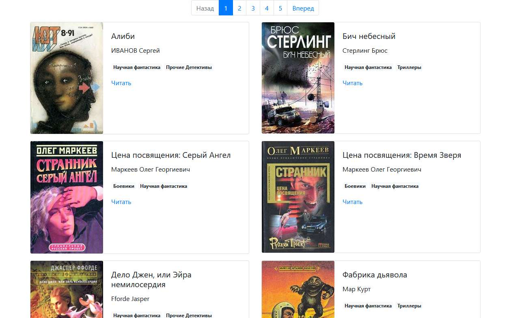

# Онлайн библиотека

Проект был создан для парсинга книг с сайта [tululu.org](http:/tululu.org) и создания собственной онлайн/офлайн библиотеки.

### Пример библиотеки



[Рабочий сайт](https://faholo.github.io/Library_parse/) 

### Установка

1. Python3 должен быть уже установлен.  

3. Рекомендуется использовать [virtualenv/venv](https://docs.python.org/3/library/venv.html) для изоляции проекта.

2. Используйте `pip` (или `pip3`, есть конфликт с Python2) для установки зависимостей:
```
pip install -r requirements.txt
```

4. Запустите файл `parse_tululu_category.py` с аргументами или без них (подробнее [ниже](https://github.com/FaHoLo/Library_parse/blob/master/READMEru.md#%D0%90%D1%80%D0%B3%D1%83%D0%BC%D0%B5%D0%BD%D1%82%D1%8B)).

#### Если вы хотите читать книги оффлайн

5. Запустите файл `render_website.py`.

6. Откройте файл `index1.html` в браузере.

7. Выберите книгу и нажмите `Читать`, чтобы открыть текст книги.

#### Если вы хотите создать свой сайт

5. Запустите файл `render_website.py` с аргументом `--run_debug`, скрипт отрендерит страницы и запустить хостинг сайта локально на вашем ПК с помощью [livereload](https://github.com/lepture/python-livereload).

6. Откройте `http://127.0.0.1:5501/pages/index1.html` в браузере.

7. Меняйте `template.html` как вам захочется, livereload будет автоматически рендерить страницы заново. Результат изменений будет отображаться в браузере.

_Важно: если вы решите изменить логику рендеринга в файле `render_website.py`, перезапустите его после изменений._

### Аргументы

Без аргументов скрипт `parse_tululu_category.py` загрузит все книги со всех страниц [этой категории](http://tululu.org/l55/) (это займет много времени). Есть несколько аргументов, которые помогут настроить этот процесс:
```
--start_page — номер первой страницы скачивания
--end_page — номер страницы, до которой будут скачаны книги
--dest_folder — путь к каталогу с результатами парсинга: картинкам, книгами, json
--skip_imgs — не скачивать обложки книг
--skip_txt — не скачивать текст книг
--json_path — указать свой путь к *.json файлу с результатами
```
Пример использования аргументов: 
```
python3 parse_tululu_category.py --start_page 3 --end_page 5 --skip_imgs --json_path example\path\
```

Для всех аргументов есть короткие обозначения, чтобы увидеть их, используйте эту команду:
```
python3 parse_tululu_category.py -h
```

### Цели проекта

Код написан в образовательных целях на онлайн-курсе для веб-разработчиков [dvmn.org](https://dvmn.org/).
